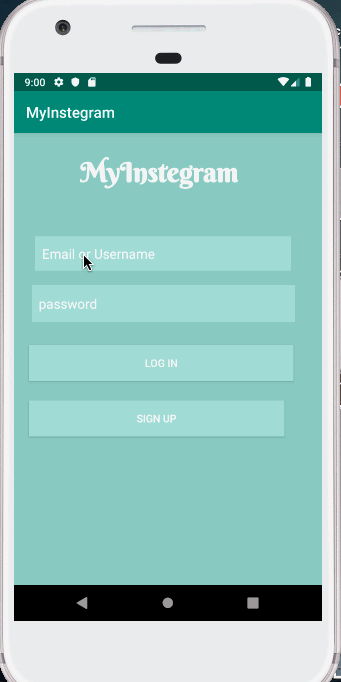

# *MyInstegram*

**MyInstegram** is a photo sharing app similar to Instagram but using Parse as its backend.

## User Stories

User can sign up to create a new account using Parse authentication.
User can log in and log out of his or her account.
The current signed in user is persisted across app restarts.
User can take a photo, add a caption, and post it to "Instagram".
User can view the last 20 posts submitted to "Instagram".
User can pull to refresh the last 20 posts submitted to "Instagram".
The user should switch between different tabs - viewing all posts (feed view), capture (camera and photo gallery view) and profile tabs (posts made) using fragments and a Bottom Navigation View.
Style the feed to look like the real Instagram feed.
User can see a list of all movies currently playing in the movie theatre

## Video Walkthrough

Here's a walkthrough of implemented user stories:

GIF created with [LiceCap](http://www.cockos.com/licecap/).

## Notes

Describe any challenges encountered while building the app.

## Open-source libraries used

- [Android Async HTTP](https://github.com/codepath/CPAsyncHttpClient) - Simple asynchronous HTTP requests with JSON parsing
- [Glide](https://github.com/bumptech/glide) - Image loading and caching library for Android
